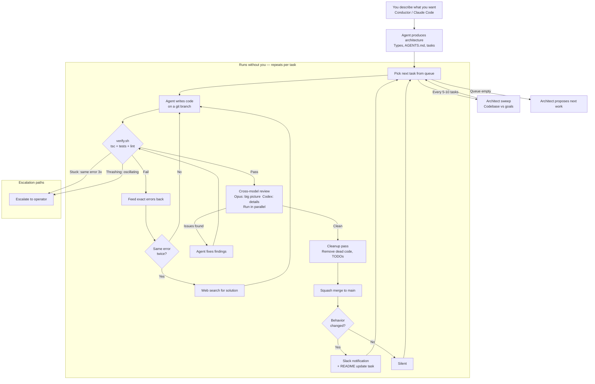
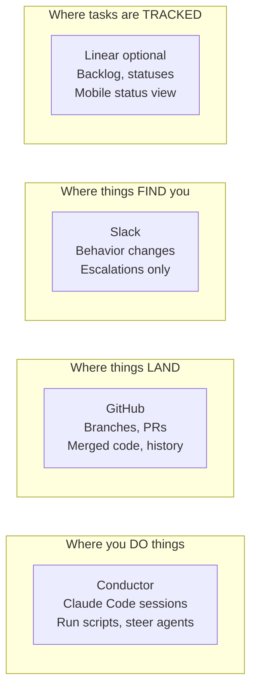
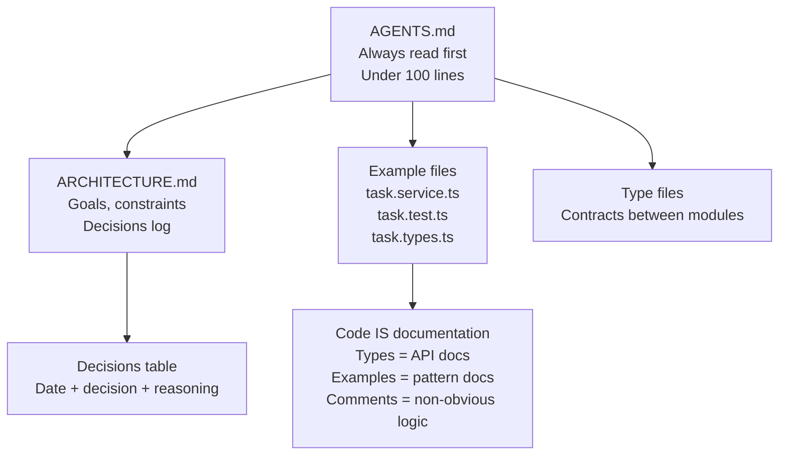

# AI Agent Orchestrator — Implementation Spec

Technical blueprint for the autonomous AI coding system.
For the non-technical operator guide, see OPERATOR_GUIDE.md.

---

## 0. Core loop (master diagram)



### Interaction surfaces



### Documentation hierarchy



---

## 1. Axioms (behavioral properties of AI coding agents)

Every design decision traces back to one of these observed properties.

| # | Axiom | Implication |
|---|-------|-------------|
| 1 | Lazy / satisficing | Multi-pass needed. Never trust single output. |
| 2 | Context quality = output quality | Curate exactly the right files per task. |
| 3 | Pattern replicators | Canonical examples drive quality — agents copy what they see. |
| 4 | Decorrelated blind spots | Cross-model review: Opus (intuitive) + Codex (pedantic). |
| 5 | Stateless | Repo files ARE the memory. No conversation state persists. |
| 6 | Only execution reveals truth | Verify by running (tsc, tests, lint), not by reading code. |
| 7 | Drift without boundaries | Explicit scope whitelist per task. |
| 8 | Small tasks >> big tasks | 1–3 files max per task. |
| 9 | Errors > instructions | Pipe compiler errors directly back. More effective than re-explaining. |
| 10 | Thrash after extended iterations | Detect convergence vs thrashing. Escalate, don't spin. |
| 11 | Garbage compounds exponentially | 5% → 15% → 35% → rewrite. Mandatory cleanup after every task. |
| 12 | Frontloading structure eliminates rounds | Types + examples before code reduces 60-70% of edit rounds. |
| 13 | Three levels of alignment | Code vs plan, plan vs goals, codebase vs goals (checked separately). |

---

## 2. Four nested loops

### Loop 1 — Retry (seconds)

Agent writes → verify.sh runs → if fail, feed exact errors back → repeat.
No fixed round limit. Uses convergence detection instead:

**Converging** (issue count decreasing, new issues each round) → keep going.
Can take 10+ rounds — that's fine.

**Thrashing** (issues oscillating, >50% overlap with 2-rounds-ago) → escalate
immediately.

**Stuck** (same exact error 3 rounds in a row) → escalate.

**Web search trigger** — if stuck on the same error twice, search for it before
the third attempt. Claude Code has web search built in. Prompt: "Search for
this error message, then fix based on what you find."

**Budget ceiling** — 30 min wall clock or 500k tokens as a safety valve.

### Loop 2 — Per-task quality (minutes)

After verify passes:
1. Cross-model review (Opus big-picture + Codex detail, run in parallel)
2. Fix review findings (agent fixes specifically what was found)
3. Cleanup pass (remove dead code, TODOs, incomplete paths)
4. Re-verify
5. Doc freshness check (if behavior changed, README must be updated)

### Loop 3 — Task queue (continuous)

1. Pick task from queue
2. Check plan vs goals alignment
3. Create branch, assemble context, assign to agent
4. Run Loop 1 + Loop 2
5. Behavior change detection
6. If behavior changed → Slack notification + auto-create README update task
7. Squash merge to main, rebase other active branches
8. Next task

### Loop 4 — Strategic (every 5-10 tasks)

1. Architect sweep: compare codebase against ARCHITECTURE.md
2. Check for: files over 300 lines, unplanned dependencies, inconsistent patterns
3. Notify operator of drift
4. When queue empties, propose next work

---

## 3. Cross-model review strategy

Two models review every diff, in parallel, with different prompts.

### Claude Opus 4.6 — big-picture review

Strengths: long context, needle-in-a-haystack, architectural consistency.
Loads: ARCHITECTURE.md + module file tree + full diff.

Prompt:
```
Review this diff against the architecture and existing patterns.
1. Does it align with the goals in ARCHITECTURE.md?
2. Is it consistent with existing patterns in the codebase?
3. Does the approach make architectural sense?
4. Any design-level concerns?
List specific issues only. Say "no issues" if clean.
```

### Codex — detail review

Strengths: pedantic, thorough, catches mechanical errors.
Loads: task definition + changed files + diff.

Prompt:
```
Review this diff against the task definition.
1. Does every function that can fail return Result<T>?
2. Are edge cases handled? (null, empty, duplicate, not-found)
3. Any off-by-one errors, missing validation, or unchecked returns?
4. Are tests covering happy path + main error case?
5. Any dead code, TODOs, or incomplete paths?
List specific issues only. Say "no issues" if clean.
```

Both reviews run simultaneously. Findings are merged and fed back to the
writing agent as a single fix prompt.

### Model assignment for writing

| Task type | Writer | Reason |
|-----------|--------|--------|
| Creative / architectural | Claude Opus | Better at design judgment |
| Precise / mechanical | Codex | More thorough on details |
| Bug fixes | Either | Errors guide the fix regardless |

---

## 4. Git and branch strategy

### Branch naming
```
task/{task-id}-{short-description}
```

### Branch lifecycle
1. Create from latest main
2. Agent writes on branch (multiple commits during retries)
3. Verify on branch
4. Cross-model review of branch diff
5. Cleanup pass, re-verify
6. Open PR with auto-generated description (behavior change summary)
7. Auto squash-merge to main
8. Rebase all other active branches onto updated main

### Parallel execution
- Multiple agents work on separate branches simultaneously
- No two agents edit the same file
- Merges serialize: one at a time, remaining branches rebase after each
- If merge conflicts arise, the later branch re-runs its task with updated main

---

## 5. Convergence detection

Replace fixed retry limits with convergence tracking.

```typescript
interface ConvergenceState {
  round: number;
  issueCount: number;
  issueHashes: Set<string>;      // hash of each unique error
  history: ConvergenceRound[];
}

interface ConvergenceRound {
  round: number;
  issueCount: number;
  issueHashes: Set<string>;
  elapsed: number;
  tokens: number;
}

function classify(state: ConvergenceState): 'converging' | 'stuck' | 'thrashing' {
  const { history } = state;
  if (history.length < 2) return 'converging';

  const current = history[history.length - 1];
  const prev = history[history.length - 2];

  // Stuck: same exact errors 3 rounds in a row
  if (history.length >= 3) {
    const prevPrev = history[history.length - 3];
    if (sameErrors(current, prev) && sameErrors(prev, prevPrev)) return 'stuck';
  }

  // Thrashing: current matches 2-rounds-ago (oscillating)
  if (history.length >= 3) {
    const prevPrev = history[history.length - 3];
    const overlap = intersectionSize(current.issueHashes, prevPrev.issueHashes);
    if (overlap / current.issueHashes.size > 0.5) return 'thrashing';
  }

  // Converging: issue count decreasing
  return 'converging';
}
```

On stuck or thrashing → escalate to operator with:
- The current error(s)
- The oscillation pattern (if thrashing)
- Files in scope
- Suggestion: "Consider providing an example file or re-scoping"

---

## 6. Verification (verify.sh)

All checks run in parallel where possible:

```bash
#!/usr/bin/env bash
set -euo pipefail

echo "=== Type Check ===" &
PID_TSC=$!
npx tsc --noEmit &
PID_TSC=$!

echo "=== Tests ===" &
npm test &
PID_TEST=$!

echo "=== Lint ===" &
npx eslint src/ --ext .ts &
PID_LINT=$!

wait $PID_TSC || { echo "Type check failed"; exit 1; }
wait $PID_TEST || { echo "Tests failed"; exit 1; }
wait $PID_LINT || { echo "Lint failed"; exit 1; }

echo "=== Doc Freshness ===" 
# If types or service files changed, check that README was updated
BEHAVIOR_FILES=$(git diff --name-only HEAD~1 | grep -E '\.(service|types)\.ts$' || true)
if [ -n "$BEHAVIOR_FILES" ]; then
  README_CHANGED=$(git diff --name-only HEAD~1 | grep -c 'README' || true)
  if [ "$README_CHANGED" -eq 0 ]; then
    echo "WARNING: Behavior-relevant files changed but README was not updated"
    # Can be made a hard fail once README update tasks are automated
  fi
fi

echo "=== All checks passed ==="
```

---

## 7. Behavior change detection

One rule: "Would a user, API consumer, or operator notice this change?"

### Notify on (behavior change):
- New or removed API endpoints / routes
- Changed request or response types
- Changed error codes or error behavior
- New environment variables or config requirements
- Database schema changes
- Auth or permission changes
- Changed retry/timeout/rate-limit behavior
- System stuck or escalation needed

### Silent (internal only):
- Refactors that don't change behavior
- Added or improved tests
- Renamed internal variables
- Lint fixes
- File splits or reorganization
- Performance improvements with same external behavior

### On behavior change detected:
1. Post to Slack with summary
2. Auto-create a task: "Update README to reflect [change description]"
3. Log in the PR description

---

## 8. Documentation hierarchy

### Files that exist in every repo

**AGENTS.md** (always read first, under 100 lines):
- Project summary (one paragraph)
- Stack
- Conventions / rules
- Links to example files to follow
- "Do NOT" list
- Links to ARCHITECTURE.md for goals/decisions

**ARCHITECTURE.md** (read for architecture tasks):
- Goals section
- Constraints section
- Decisions log table: date, decision, reasoning

**README.md** (for humans on GitHub):
- What it does, how to run it, API surface
- Updated automatically when behavior changes

### Files that don't exist
- No docs/ directory
- No wiki
- No per-directory READMEs
- No separate API docs (types ARE the API docs)
- No contributing guide (AGENTS.md IS the contributing guide)

### Sprawl prevention rules
- One fact, one place. AGENTS.md links to ARCHITECTURE.md, never duplicates.
- Every architecture conversation ends with: "update DECISIONS.md with what we decided."
- verify.sh checks doc freshness on behavior changes.
- If a doc isn't loaded by the orchestrator or checked by verify, delete it.

### Cross-model memory fix
Claude and Codex have separate conversation histories. Neither remembers
what the other discussed. All shared knowledge lives in repo files:
- ARCHITECTURE.md for goals
- DECISIONS.md (or decisions section in ARCHITECTURE.md) for reasoning
- Type files for contracts
- Example files for patterns

If it's not written in a repo file, it doesn't exist for either model.

---

## 9. Context assembly per task

Each task gets a minimal context package. Never load everything.

| Task type | Context loaded |
|-----------|---------------|
| Add a function | AGENTS.md + one example service + relevant types |
| Fix a bug | AGENTS.md + failing test output + the broken file |
| Architecture change | AGENTS.md + ARCHITECTURE.md + module file tree |
| Cross-model review | AGENTS.md + ARCHITECTURE.md + task def + diff |
| Status query | File tree + task queue state + active branches |
| Architect sweep | ARCHITECTURE.md + file tree + file sizes + deps |

The orchestrator assembles context per task. The agent never decides
what to load — it receives exactly what it needs.

---

## 10. Task definition schema

```typescript
interface TaskDefinition {
  id: string;
  title: string;
  description: string;            // Natural language, 2-3 sentences
  scope: {
    editableFiles: string[];      // Explicit list or glob
    readOnlyContext: string[];    // Files to load but not edit
    forbiddenFiles: string[];    // Never touch these
  };
  acceptanceCriteria: string[];   // Testable conditions
  dependsOn: string[];            // Task IDs that must complete first
  model: 'claude' | 'codex' | 'auto';  // Preferred writer
}
```

---

## 11. Parallelism model

### Within a task (verify steps)
Type check, tests, and lint run simultaneously.

### Within a task (review)
Opus big-picture review and Codex detail review run simultaneously.

### Across tasks (pipeline parallelism)
While task A is in review, task B can start writing — as long as they
don't share editable files.

### Across tasks (branch parallelism)
Multiple agents work on separate branches at the same time.
Each branch is independent. Merges serialize.

### Speed formula
Total time ≈ (rounds per task × time per round) / parallel agents
Frontloading (types + examples) reduces rounds.
Parallelism multiplies throughput.

---

## 12. Interaction model

### Conductor (primary — where you DO things)
- Talk to Claude Code to define architecture
- Run scripts to trigger tasks
- Steer agents when they need direction
- Check status conversationally

### GitHub (record — where things LAND)
- Branches and PRs created automatically
- PR descriptions contain behavior change summaries
- Squash merges to main
- Check from phone via GitHub mobile

### Slack (notifications — where things FIND you)
- Webhook fires on behavior changes
- Webhook fires on escalations (stuck/thrashing)
- Reply in threads to give direction
- Never used for status polling — that's Conductor or Linear

### Linear (optional — where tasks are TRACKED)
- Task queue with statuses (backlog → in progress → review → done)
- GitHub PR linking built in
- Mobile app for status checking
- If not using Linear, TODO.md in repo works

---

## 13. Production promotion gate

Three checks before deploy:
1. Full e2e test suite against staging
2. Behavior changelog since last deploy (auto-generated from PR descriptions)
3. Goals alignment check (does current codebase serve ARCHITECTURE.md goals?)

Operator approves based on the behavior changelog.
On production break: auto-revert to last deploy tag, create fix task.

---

## 14. Auto-closing loops

Every process has a closed loop. Nothing can silently rot.

| Trigger | Auto-response |
|---------|--------------|
| Behavior change detected | Slack notification + README update task created |
| Production break | Auto-revert to last deploy tag + fix task created |
| Task queue empty | Architect sweep + propose next work |
| Architecture conversation | "Update DECISIONS.md" appended to prompt |
| Doc freshness stale | verify.sh fails until docs updated |
| Agent stuck 2 rounds on same error | Web search triggered before retry |
| Agent stuck 3 rounds | Escalate to operator |
| Agent thrashing | Escalate immediately |

---

## 15. Validated results

Tested on a TypeScript task management testbed:

| Test | Result |
|------|--------|
| Task 1: add new module | First-pass clean, 0 retries |
| Task 2: add to existing file | First-pass clean, 0 retries |
| Task 3: cross-module relationships | First-pass clean, 0 retries |
| Cross-model review (Codex reviewing Claude) | Found 3 real issues |
| Fix review findings | Fixed in 1 round, verify clean |

Issues Codex found that Claude missed:
1. removeTagFromTask silently succeeds when tag isn't on the task
2. createTask tests don't assert tagIds default value
3. addTagToTask duplicate handling works but semantics not pinned in tests

All three are real gaps, not style nits. This validates that decorrelated
models catch different categories of bugs (Axiom 4).
