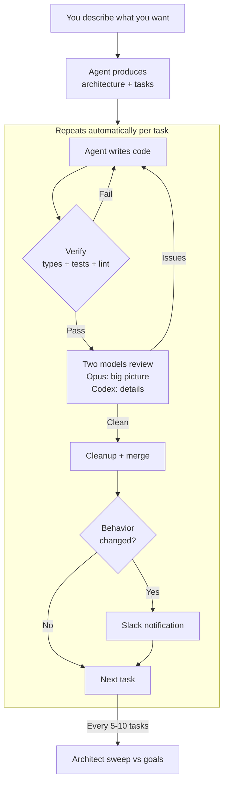

# AI Agent Coding — Operator Guide

How to manage AI agents that build your software.
You don't write code. You don't read code.
You describe what you want and verify results.

For the technical spec, see IMPLEMENTATION_SPEC.md.

---

## The system at a glance

---

## How it works

You sit in Conductor with a Claude Code session. You describe what you want
in plain English. Claude Code turns that into architecture, types, and tasks.
Then the system runs autonomously — writing code, verifying it, getting it
reviewed by a second model, cleaning it up, and merging it — until either
everything's done or something needs your input.

You get pinged for exactly two reasons:
1. A change that affects behavior (new endpoint, changed config, etc.)
2. The system is stuck and needs your direction

Everything else happens silently.

---

## Your tools (each does one thing)

**Conductor** — where you DO things. Talk to Claude Code, define architecture,
run tasks, steer agents. This is your cockpit.

**GitHub** — where things LAND. Branches, PRs, merged code, history. The
permanent record. Check PR descriptions from your phone for status.

**Slack** — where things FIND you. Behavior change notifications and
escalations only. Reply in threads to give direction.

**Linear** (optional) — where tasks are TRACKED. Backlog, statuses, history.
Mobile app for checking status. If you don't want another system, a TODO.md
file in the repo works too.

---

## What you actually do

### Starting a project

Talk to Claude Code in Conductor. Describe what you're building, what it
should do, what constraints matter. Claude Code produces:
- ARCHITECTURE.md — goals, constraints, decisions log
- Type definitions — the shape of data
- Example files — patterns for agents to follow
- AGENTS.md — conventions agents read first
- A task backlog — features broken into small pieces

Review at a high level: "does this match what I described?" If something's
off, say so conversationally.

### When requirements change

Same Conductor session. "Actually, orders should also support cancellation."
Claude Code:
1. Updates ARCHITECTURE.md and types
2. Checks what existing code is affected
3. Creates migration tasks
4. Updates DECISIONS.md with the reasoning

### Responding to notifications

Slack pings you with a behavior change summary:
> "New endpoint: POST /orders/cancel. New env var: CANCEL_WINDOW_MINUTES."

You reply in the thread:
- "Looks right. Set the cancel window to 5 min in staging." → system acts
- "Revert that change." → system reverts
- "Re-scope this as..." → system creates new task

### Responding to escalations

Slack pings you when the system is stuck:
> "Thrashing on auth middleware after 6 rounds."

You reply with direction:
- "Use the same auth pattern as the orders service."
- "This needs a different approach — let me rethink."

### Checking status

Open Linear on your phone (or ask in Conductor: "what's happening right now?").
Or check open PRs on GitHub.

### Promoting to production

When you're ready to deploy, ask in Conductor: "ready for prod?" The system
runs: full e2e against staging, behavior changelog since last deploy, goals
alignment check. You approve based on the changelog.

---

## The core loop (what happens automatically)

For each task in the queue:
1. **Agent writes code** on a git branch (Claude or Codex, with scoped context)
2. **Verification runs** — type check, tests, lint (all three in parallel)
3. **If verification fails** — exact errors fed back, agent fixes, re-verify
   - Convergence detection: if issues are decreasing, keep going
   - Stuck detection: same error 3x = escalate to you
   - Thrash detection: errors oscillating = escalate to you
   - Budget ceiling: 30 min / 500k tokens as safety valve
   - Web search: if stuck on same error twice, search before third attempt
4. **If verification passes** — cross-model review (both run in parallel):
   - Claude Opus reviews big picture: fits architecture? consistent patterns?
   - Codex reviews details: edge cases? validation? off-by-one?
5. **Fix review findings** — agent fixes specifically what reviewers found
6. **Cleanup pass** — remove dead code, TODOs, incomplete paths
7. **Merge** — squash merge to main, rebase other active branches
8. **Behavior check** — would a user notice this change?
   - If yes → Slack notification + README update task auto-created
   - If no → silent
9. **Next task** from queue

Every 5-10 tasks: architect sweep checks codebase against goals.
When queue empties: architect proposes what to work on next.
If production breaks: auto-revert to last deploy tag.

---

## The two AI models and why both matter

**Claude Opus 4.6** — intuitive, strong at long context and
needle-in-a-haystack. Reads the full architecture + codebase patterns +
diff and catches inconsistencies.
Best for: writing creative/architectural code, big-picture review.

**Codex** — pedantic, thorough, detail-oriented ("autistic" in the best
sense). Catches edge cases, missing validation, off-by-ones.
Best for: writing precise/mechanical code, line-by-line review.

They run in parallel on review — different prompts, different blind spots.
Claude asks "does this fit?" Codex asks "did you miss anything?"

Validated result: Codex found 3 real issues in Claude's code that Claude
didn't think about (duplicate tag handling, missing default assertion,
silent success on not-found).

---

## Documentation: how it stays clean

Docs follow the same closed-loop discipline as code — if they're not
verified, they rot.

**Three levels, one entry point:**
- AGENTS.md — always read first, under 100 lines. Links to everything else.
- ARCHITECTURE.md — goals, constraints, decisions log. Read for architecture tasks.
- Code itself — types document contracts, example files document patterns,
  comments explain non-obvious logic. Code IS documentation.

**Rules that prevent sprawl:**
- No docs/ directory. No wiki. No per-directory READMEs.
- One fact lives in one place. AGENTS.md links, never duplicates.
- Every architecture conversation ends with "update DECISIONS.md."
- Behavior changes trigger a README update task automatically.
- verify.sh checks doc freshness — if behavior changed but README didn't, it fails.

**Cross-model memory fix:** Claude and Codex have separate conversation
histories. Neither remembers what the other discussed. The repo files
ARE the shared memory. If a decision isn't in DECISIONS.md, it doesn't
exist for either model.

---

## When things go wrong

**Agent produces bad code** — the verify loop catches most issues. If something
passes verify but is architecturally wrong, the cross-model review catches it.
If both miss it, the periodic architect sweep catches it.

**Agent is stuck in a loop** — convergence detection notices: stuck (same error 3x)
or thrashing (errors oscillating). Escalates to you with the error context.

**Codebase drifts from goals** — the architect sweep runs every 5-10 tasks and
compares the actual codebase against ARCHITECTURE.md. Notifies you of drift.

**Production breaks** — auto-revert to last deploy tag. Create a fix task.

**Documentation goes stale** — verify.sh catches it. Behavior changes without
doc updates fail verification.

---

## Speed levers

Speed comes from parallelism, not fewer rounds:
- Multiple tasks run on separate branches simultaneously
- Type check, tests, and lint run in parallel within each task
- Both model reviews run in parallel
- Pipeline parallelism: task B starts writing while task A is in review
- Frontloading types + examples reduces rounds per task

---

## What was validated

On a TypeScript testbed project:
- Task 1 (add a module): first-pass clean, 0 retries
- Task 2 (add to existing file): first-pass clean, 0 retries
- Task 3 (cross-module relationships): first-pass clean, 0 retries
- Cross-model review: Codex found 3 real issues in Claude's code
- Fix round: Claude fixed all 3 findings in one pass, verify clean

The framework produces correct code when AGENTS.md + examples are clear.
Real codebases with more ambiguity will need more rounds — that's what
the convergence detection handles.
